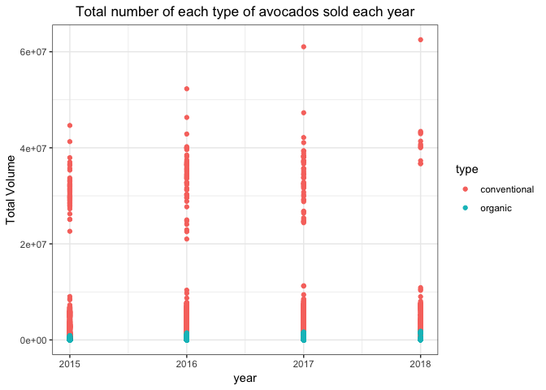

<!-- README.md is generated from README.Rmd. Please edit that file -->
avocado
=======

The dataset contains historical data on avocado prices and sales volume in multiple US markets. [source data](https://www.kaggle.com/neuromusic/avocado-prices/home) is from [kaggle](https://www.kaggle.com/).

For more relevant data, please refer to [here](http://www.hassavocadoboard.com/retail/volume-and-price-data)

Installation
------------

You can install the avocado package from [my github](https://github.com/Irissq28/avocado) or run the code below in console.

``` r
devtools::install_github("Irissq28/avocado")
#> Skipping install of 'avocado' from a github remote, the SHA1 (eb028f10) has not changed since last install.
#>   Use `force = TRUE` to force installation
```

Example
-------

Load the package.

``` r
library(avocado)
```

Familiar with the data frame.

``` r
summary(avocado)
#>        X1             Date             AveragePrice    Total Volume     
#>  Min.   : 0.00   Min.   :2015-01-04   Min.   :0.440   Min.   :      85  
#>  1st Qu.:10.00   1st Qu.:2015-10-25   1st Qu.:1.100   1st Qu.:   10839  
#>  Median :24.00   Median :2016-08-14   Median :1.370   Median :  107377  
#>  Mean   :24.23   Mean   :2016-08-13   Mean   :1.406   Mean   :  850644  
#>  3rd Qu.:38.00   3rd Qu.:2017-06-04   3rd Qu.:1.660   3rd Qu.:  432962  
#>  Max.   :52.00   Max.   :2018-03-25   Max.   :3.250   Max.   :62505647  
#>       4046               4225               4770        
#>  Min.   :       0   Min.   :       0   Min.   :      0  
#>  1st Qu.:     854   1st Qu.:    3009   1st Qu.:      0  
#>  Median :    8645   Median :   29061   Median :    185  
#>  Mean   :  293008   Mean   :  295155   Mean   :  22840  
#>  3rd Qu.:  111020   3rd Qu.:  150207   3rd Qu.:   6243  
#>  Max.   :22743616   Max.   :20470573   Max.   :2546439  
#>    Total Bags         Small Bags         Large Bags     
#>  Min.   :       0   Min.   :       0   Min.   :      0  
#>  1st Qu.:    5089   1st Qu.:    2849   1st Qu.:    127  
#>  Median :   39744   Median :   26363   Median :   2648  
#>  Mean   :  239639   Mean   :  182195   Mean   :  54338  
#>  3rd Qu.:  110783   3rd Qu.:   83338   3rd Qu.:  22029  
#>  Max.   :19373134   Max.   :13384587   Max.   :5719097  
#>   XLarge Bags           type                year         region         
#>  Min.   :     0.0   Length:18249       Min.   :2015   Length:18249      
#>  1st Qu.:     0.0   Class :character   1st Qu.:2015   Class :character  
#>  Median :     0.0   Mode  :character   Median :2016   Mode  :character  
#>  Mean   :  3106.4                      Mean   :2016                     
#>  3rd Qu.:   132.5                      3rd Qu.:2017                     
#>  Max.   :551693.7                      Max.   :2018
```

``` r
df_head <- head(avocado)
knitr::kable(df_head, align = "c")
```

|  X1 |    Date    | AveragePrice | Total Volume |   4046  |    4225   |  4770  | Total Bags | Small Bags | Large Bags | XLarge Bags |     type     | year | region |
|:---:|:----------:|:------------:|:------------:|:-------:|:---------:|:------:|:----------:|:----------:|:----------:|:-----------:|:------------:|:----:|:------:|
|  0  | 2015-12-27 |     1.33     |   64236.62   | 1036.74 |  54454.85 |  48.16 |   8696.87  |   8603.62  |    93.25   |      0      | conventional | 2015 | Albany |
|  1  | 2015-12-20 |     1.35     |   54876.98   |  674.28 |  44638.81 |  58.33 |   9505.56  |   9408.07  |    97.49   |      0      | conventional | 2015 | Albany |
|  2  | 2015-12-13 |     0.93     |   118220.22  |  794.70 | 109149.67 | 130.50 |   8145.35  |   8042.21  |   103.14   |      0      | conventional | 2015 | Albany |
|  3  | 2015-12-06 |     1.08     |   78992.15   | 1132.00 |  71976.41 |  72.58 |   5811.16  |   5677.40  |   133.76   |      0      | conventional | 2015 | Albany |
|  4  | 2015-11-29 |     1.28     |   51039.60   |  941.48 |  43838.39 |  75.78 |   6183.95  |   5986.26  |   197.69   |      0      | conventional | 2015 | Albany |
|  5  | 2015-11-22 |     1.26     |   55979.78   | 1184.27 |  48067.99 |  43.61 |   6683.91  |   6556.47  |   127.44   |      0      | conventional | 2015 | Albany |

Load `ggplot`, `tidyverse` and `dplyr` to make a simple plot, which shows the total number of each type of avocados sold each year.

``` r
library(ggplot2)
library(tidyverse)
#> ── Attaching packages ─────────────────────────────────────────── tidyverse 1.2.1 ──
#> ✔ tibble  1.4.2     ✔ purrr   0.2.5
#> ✔ tidyr   0.8.2     ✔ dplyr   0.7.8
#> ✔ readr   1.1.1     ✔ stringr 1.3.1
#> ✔ tibble  1.4.2     ✔ forcats 0.3.0
#> ── Conflicts ────────────────────────────────────────────── tidyverse_conflicts() ──
#> ✖ dplyr::filter() masks stats::filter()
#> ✖ dplyr::lag()    masks stats::lag()
library(dplyr)
avocado %>%
  group_by(type)  %>%
  ggplot(aes(x = year,y = `Total Volume`, color = type)) +
  theme_bw() +
  geom_point() +
  theme(plot.title = element_text(size = 13, hjust = 0.5)) +
  labs(x="year",y="Total Volume",
       title="Total number of each type of avocados sold each year")
```



The table shows the mean number of avocados sold of each region.

``` r
sold_average <-avocado %>%
  filter(year == 2018) %>%
  group_by(region) %>%
  summarise(`Total Volume Mean` = mean(`Total Volume`))

knitr::kable(head(sold_average), align = "c")
```

|        region       | Total Volume Mean |
|:-------------------:|:-----------------:|
|        Albany       |      64249.42     |
|       Atlanta       |     342975.94     |
| BaltimoreWashington |     506620.96     |
|        Boise        |      50614.98     |
|        Boston       |     359875.25     |
|   BuffaloRochester  |      88492.42     |

The plot shows the region where the mean of total number of avocados sold larger than the mean of each region.

``` r
sold_average %>%
  filter(`Total Volume Mean` > mean(`Total Volume Mean`)) %>%
  ggplot(aes(x= `Total Volume Mean`, y = region)) +
  geom_point() +
  theme_bw() +
  theme(plot.title = element_text(size = 9, hjust = 0.5)) +
  labs(x="Mean of Total Volume",y="region",
       title="The region where the mean of total number of avocados sold larger than the mean of each region")
```


